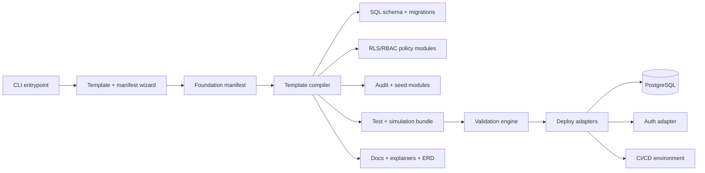
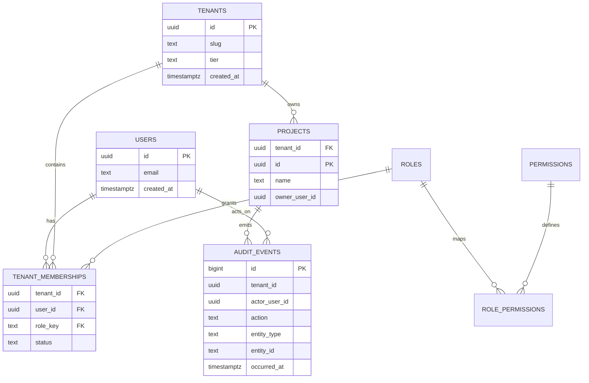
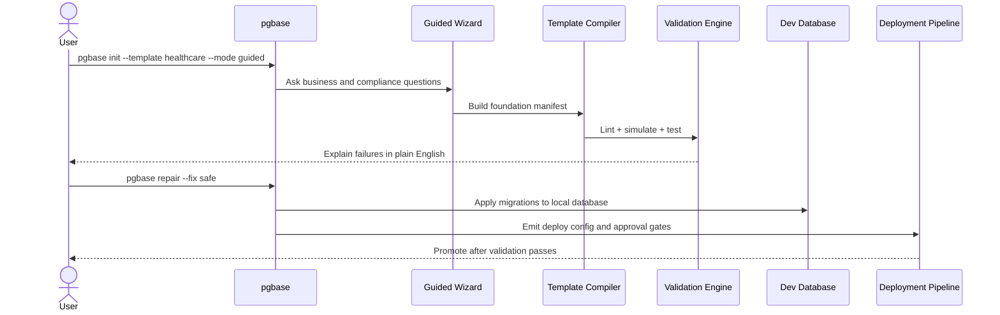

# Secure Guardrail-Driven CLI for PostgreSQL Application Foundations

## Executive summary

A secure CLI that generates PostgreSQL application foundations for both engineers and low/no-code builders is not only possible, but commercially attractive if it is positioned as a **guardrail and verification product** rather than a generic scaffolder. The real buyer pain is not “creating auth tables quickly”; it is preventing broken access control, tenant leakage, insecure defaults, and upgrade drift while still getting to a working schema in minutes. That framing matches current security guidance: broken access control remains a top web risk, PostgreSQL row-level security defaults to deny-all when enabled without a policy, and secure software guidance now expects security practices to be built into the software delivery lifecycle rather than bolted on later. citeturn17view11turn16view0turn18view0turn16view10

The best product design is a **manifest-driven compiler** that emits SQL schema templates, RLS/RBAC policies, audit mechanisms, seed data generators, test suites, migration bundles, environment policies, and human-readable explainers. The default tenancy model should usually be **pooled multitenancy with mandatory tenant keys and restrictive RLS**, because that scales well; but the product should also support bridge and silo models for customers who optimize more for isolation than density. Authorization should combine **RBAC for coarse capabilities** with **ABAC/ReBAC-style tenant, ownership, and workflow predicates** for row-level decisions, which is the direction both OWASP and NIST guidance push teams toward for application authorization. citeturn17view18turn17view17turn17view16turn18view3turn31view1turn31view0

The security baseline should be updated to current standards. The older NIST SP 800-63B has been superseded; the current reference set is **NIST SP 800-63-4** and **SP 800-63B-4**, published in July 2025. For auth adapters, the most pragmatic no-framework-lock-in approach is to support: Supabase Auth plus RLS-aware JWT claims; generic OIDC/JWT federation; and Firebase Authentication with server-side token verification and custom claims, with Identity Platform tenants available when the auth boundary itself needs multitenancy. citeturn34view0turn34view1turn34view2turn21view16turn16view16turn16view17turn16view18

For regulated templates, the product should encode compliance-specific defaults instead of leaving them to integrators. A school template should assume a **FERPA-first data model** with disclosure ledgers and actor-purpose logging. A healthcare template should assume **HIPAA-oriented safeguards**, especially audit controls, de-identified seed data, and stricter support-access workflows. GDPR-oriented packs should enforce **data protection by design and by default**, plus records-of-processing support. SOC 2 should be treated as a controls-evidence target, not a law. On that basis, a realistic roadmap is a six- to twelve-month build with an initial team of roughly five to seven core contributors plus fractional design/compliance support. citeturn36view5turn36view2turn17view0turn36view0turn37search2turn17view7turn17view8turn17view10

## Section plan

This document is organized around five deliverables:

- an executive assessment of whether the product should exist and how it should be framed;
- detailed findings on positioning, guardrails, architecture, validation, and user experience;
- a practical interpretation of compliance requirements for school, healthcare, SaaS, and marketplace templates;
- an explicit risk and mitigation model;
- an actionable six- to twelve-month implementation roadmap with milestones, staffing, and success metrics.

## Detailed findings

### Product positioning and messaging

The most effective message is: **“Generate production-ready Postgres foundations that are secure by default, explainable, and verifiable.”** The wrong message is: “Spin up auth and RBAC in one minute.” The former sells reduction of one of the most common and damaging failure categories; the latter sells speed alone and invites comparison with generic code generators. Broken access control is still the highest-profile web risk, and PostgreSQL’s own security primitives are strong enough that a product can credibly promise database-centric defense in depth if it configures them correctly. Supabase’s RLS guidance and security advisors also show that even teams using mature platforms repeatedly need help detecting tables without RLS, mutable function `search_path`, and overly permissive policy composition. citeturn17view11turn16view0turn16view13turn27view0

The value proposition should therefore have three layers. The first is **speed**: teams get a running foundation in minutes. The second is **safety**: the generated foundation starts from deny-by-default, explicit grants, scoped roles, and tested RLS. The third is **evidence**: the CLI emits tests, reports, diagrams, and explainers that help teams prove to reviewers, security, and auditors what the generated system actually guarantees. That third layer is what turns an internal developer utility into a product category with budget. It also aligns with NIST’s SSDF emphasis on integrating secure development practices into the SDLC and with OWASP ASVS’s role as a verification baseline. citeturn16view10turn17view12turn18view2

The target personas are different enough that the product should speak differently to each of them. For staff or platform engineers, the product promise is **eliminate repetitive security plumbing while preserving SQL control**. For product-minded full-stack teams and agencies, the promise is **ship tenant-safe SaaS foundations without rediscovering every authorization edge case**. For low/no-code builders, the promise is **safe presets, plain-English explainers, and repair commands instead of free-form policy authoring**. For security and compliance leaders, the promise is **standardized foundations, machine-checkable controls, and less template drift across teams**. The product should not force a specific application framework; it should emit SQL-first assets plus optional adapter packs for common auth and CI environments.

A sensible packaging model is tiered:

| Package | Best fit | Recommended contents | Recommended pricing posture |
|---|---|---|---|
| Community | Individual engineers, evaluation teams | Core templates, local validation, ERD generation, basic docs | Free / source-available OSS core |
| Pro | Small teams, agencies, technical founders | Advanced templates, policy simulation, upgrade planner, seed generator, explainers | Per-developer monthly |
| Team | Product teams, internal platforms | Org policy packs, drift detection, CI integrations, shared registries, audit bundles | Workspace monthly |
| Enterprise | Health, education, large SaaS | Custom compliance packs, support-access controls, SSO, approval workflows, signed releases, migration assistance | Annual contract |

The go-to-market motion should also be layered. Start bottom-up with an open core that developers can run locally, then monetize on **hosted validation, compliance packs, org policy registries, and deployment controls**. That mirrors how teams adopt database tooling: developers try the local CLI first, then platform/security functions pay for standardization and evidence later. For education and healthcare, the partner channel matters: agencies, implementation consultants, and IT integrators are likely early multipliers because they repeatedly rebuild very similar permission models.

### Guardrail framework

The core design principle is simple: **every generated template should be safer than the average hand-built implementation, and every dangerous override should become visible, explainable, and testable**. That principle is necessary because PostgreSQL’s primitives are powerful but sharp-edged. Table owners bypass RLS unless `FORCE ROW LEVEL SECURITY` is enabled, roles with `BYPASSRLS` always bypass it, multiple permissive policies compose with `OR`, referential integrity checks can bypass row security and form covert channels, and functions or policies can become Trojan-horse vectors if search path and trusted object ownership are not controlled. Firebase’s own security-rules documentation shows the same broader lesson in a different stack: teams need locked defaults, insecure-rule warnings, playground validation, and local emulation because “simple config” is often where major data exposure begins. citeturn20view0turn20view1turn30view1turn21view8turn21view9

#### Policy-level guardrail

##### Deny-by-default exposure and explicit publication

**Rationale.** OWASP recommends deny-by-default and validation on every request, and PostgreSQL enforces a default-deny posture on an RLS-enabled table if no policy exists. At the same time, PostgreSQL privileges and the special `PUBLIC` role can accidentally make future objects reachable if default privileges are not corrected. In Supabase-style data APIs, any exposed table without RLS can be accessed by roles that otherwise have matching grants. This should become the CLI’s first invariant: **nothing is exposed until it is intentionally published**. citeturn18view0turn18view2turn16view0turn16view2turn16view3turn16view13

**Implementation steps.** The CLI should, on initialization, revoke broad defaults from `PUBLIC`, generate a dedicated application schema, set restrictive default privileges, and mark every externally reachable table as requiring an explicit `publish: true` decision in the manifest. It should treat “API exposure,” “SQL privileges,” and “RLS policy presence” as three separate gates, not one. For low/no-code mode, the published surface should be a short allowlist, visible in a dashboard-style summary before any deployment.

**Example SQL and CLI.**
```sql
revoke all on schema public from public;
revoke all on all tables in schema public from public;
alter default privileges in schema public revoke all on tables from public;
alter default privileges in schema public revoke all on functions from public;

create schema if not exists app;

create role app_runtime noinherit login password 'replace-me';
grant usage on schema app to app_runtime;

alter table app.projects enable row level security;
```

```bash
pgbase init --template saas --mode guided
pgbase publish add app.projects --roles authenticated
pgbase verify --checks exposure,privileges,rls
```

**Test cases.**
```bash
pgbase verify access --role anon --sql "select * from app.projects"
# expected: denied

pgbase verify access --role authenticated --sql "select * from app.projects"
# expected: denied until a policy is present
```

**Rollout plan.** In alpha, surface this as an advisory warning. In beta, make it the default for all new projects. At general availability, block deployment of any object that is marked externally reachable while missing either explicit publication metadata, grants review, or RLS. A strong success metric is: **100 percent of externally reachable generated tables ship with RLS enabled and zero `PUBLIC` table grants**.

##### Role-plus-attribute authorization with tenant context

**Rationale.** NIST still defines RBAC as a role-centered access model and notes its administrative benefits, but both NIST’s ABAC guidance and OWASP’s authorization guidance make the same practical point: roles alone are too coarse for most modern application authorization decisions. A secure template product should therefore generate **RBAC for coarse entitlements** and **ABAC/ReBAC predicates for tenant, ownership, status, workflow, or relationship checks**. citeturn31view2turn31view0turn31view1turn18view3

**Implementation steps.** The generated schema should separate `roles`, `permissions`, and `tenant_memberships`, then feed RLS from those relationships plus contextual session settings such as `app.current_user_id` and `app.current_tenant_id`. The CLI should never encourage “super-admin” as an all-purpose application role. Instead, it should generate specific capabilities, relation checks, and time-bounded support roles. In guided mode, the permission model should be presented as “who can do what in which tenant under which condition,” not as free-form SQL from the start.

**Example SQL and CLI.**
```sql
create table app.roles (
  role_key text primary key,
  description text not null
);

create table app.permissions (
  permission_key text primary key,
  description text not null
);

create table app.role_permissions (
  role_key text not null references app.roles(role_key),
  permission_key text not null references app.permissions(permission_key),
  primary key (role_key, permission_key)
);

create table app.tenant_memberships (
  tenant_id uuid not null references app.tenants(id),
  user_id uuid not null references app.users(id),
  role_key text not null references app.roles(role_key),
  status text not null check (status in ('active','invited','suspended')),
  primary key (tenant_id, user_id, role_key)
);
```

```bash
pgbase roles add billing_admin --permissions invoice.read,invoice.write
pgbase roles add support_readonly --permissions tenant.read --expires 8h
pgbase explain auth-model
```

**Test cases.**
```bash
pgbase simulate access \
  --user user_a \
  --tenant tenant_a \
  --action invoice.write \
  --resource invoice:123
# expected: allow if membership active and role grants permission

pgbase simulate access \
  --user user_a \
  --tenant tenant_b \
  --action invoice.write \
  --resource invoice:123
# expected: deny
```

**Rollout plan.** Start with fixed preset roles in alpha. Add custom roles and relationship predicates in beta. In later releases, add approval workflows for creating roles that can cross tenant boundaries. A useful metric is: **less than one role escalation bug per quarter in reference templates, with cross-tenant simulation tests passing above 99 percent**.

#### Schema-level guardrails

##### Mandatory tenant keys, composite foreign keys, and indexed relationships

**Rationale.** In shared-table multitenancy, tenant scope must exist in the schema itself, not only in application memory. PostgreSQL foreign keys preserve referential integrity, and official guidance plus platform advisors consistently flag unindexed foreign keys as both correctness and performance problems. At scale, multitenant PostgreSQL guidance points toward sharding or distributing on a tenant key, while separate databases remain the higher-isolation but higher-operations-cost option. citeturn21view3turn27view0turn17view18turn17view17

**Implementation steps.** Every tenant-scoped table in pooled mode should carry a non-null `tenant_id`, and every relationship between tenant-scoped tables should prefer a composite key pattern like `(tenant_id, id)` to reduce accidental cross-tenant joins. The linter should block any generated table in pooled mode if it lacks `tenant_id`, if its foreign keys do not preserve tenant scoping, or if key foreign-key and tenant predicates are not indexed. In school and healthcare packs, the same pattern should apply to student- and patient-domain data unless the template is explicitly in a silo model.

**Example SQL and CLI.**
```sql
create table app.customers (
  tenant_id uuid not null references app.tenants(id),
  id uuid not null default gen_random_uuid(),
  email text not null,
  primary key (tenant_id, id),
  unique (tenant_id, email)
);

create table app.invoices (
  tenant_id uuid not null references app.tenants(id),
  id uuid not null default gen_random_uuid(),
  customer_id uuid not null,
  total_cents bigint not null check (total_cents >= 0),
  primary key (tenant_id, id),
  foreign key (tenant_id, customer_id)
    references app.customers(tenant_id, id)
);

create index invoices_tenant_customer_idx
  on app.invoices (tenant_id, customer_id);
```

```bash
pgbase verify schema --checks tenant-keys,foreign-keys,indexes
pgbase explain table app.invoices
```

**Test cases.**
```bash
pgbase verify sql --sql "
insert into app.invoices (tenant_id, customer_id, total_cents)
values ('tenant-a','customer-from-tenant-b',1000)"
# expected: foreign key violation

pgbase verify plan --sql "
select * from app.invoices
where tenant_id = 'tenant-a' and customer_id = '...'"
# expected: index scan or bitmap index usage
```

**Rollout plan.** Advisory in alpha, default-on for pooled templates in beta, and hard-block in general availability for all pooled templates. Success metric: **100 percent of pooled tenant tables contain `tenant_id`, and 95 percent or more of tenant-filtered joins use indexed paths in generated benchmarks**.

##### Safe RLS composition, `FORCE RLS`, and no bypass roles in runtime paths

**Rationale.** PostgreSQL’s RLS is strong, but not foolproof if miscomposed. Owners bypass RLS unless `FORCE ROW LEVEL SECURITY` is enabled. `BYPASSRLS` roles always bypass it. Multiple permissive policies combine with `OR`, restrictive policies with `AND`, and referential integrity checks bypass row security. That means the generator must treat RLS as a **compiled system**, not a set of hand-authored snippets. citeturn20view0turn20view1turn21view0

**Implementation steps.** Generate one **restrictive tenant-boundary policy** per tenant-scoped table, then layer additional permissive policies for capability-specific reads and writes. Never let application runtime roles own protected tables. Generate owner and migration roles separately from runtime roles. Add `FORCE ROW LEVEL SECURITY` to protected tables in pooled mode. Add linters that fail when a runtime role inherits from a privileged role, or when a protected table lacks both `ENABLE RLS` and `FORCE RLS`.

**Example SQL and CLI.**
```sql
alter table app.invoices enable row level security;
alter table app.invoices force row level security;

create policy invoices_tenant_boundary
  on app.invoices
  as restrictive
  using (
    tenant_id = current_setting('app.current_tenant_id', true)::uuid
  )
  with check (
    tenant_id = current_setting('app.current_tenant_id', true)::uuid
  );

create policy invoices_reader
  on app.invoices
  as permissive
  for select
  using (
    exists (
      select 1
      from app.tenant_memberships m
      join app.role_permissions rp
        on rp.role_key = m.role_key
      where m.tenant_id = app.invoices.tenant_id
        and m.user_id = current_setting('app.current_user_id', true)::uuid
        and m.status = 'active'
        and rp.permission_key = 'invoice.read'
    )
  );
```

```bash
pgbase verify rls --strict
pgbase simulate attack --kind owner-bypass
```

**Test cases.**
```bash
pgbase simulate attack --kind cross-tenant-read --user user_a --tenant tenant_a
# expected: no rows from tenant_b

pgbase simulate attack --kind owner-bypass
# expected: denied for protected tables because FORCE RLS is active
```

**Rollout plan.** Generate these policies by default in alpha. Add policy-graph visualization in beta so users can see restrictive versus permissive composition. In GA, block deploys if any protected table is missing `FORCE RLS` in pooled mode. Success metric: **zero passing attack simulations for owner bypass or cross-tenant reads on reference templates**.

##### Safe privileged functions and immutable `search_path`

**Rationale.** PostgreSQL explicitly warns that functions, triggers, and row-level policies can Trojan-horse other users. It also documents that `SECURITY DEFINER` functions require a safe `search_path`, excluding schemas writable by untrusted users; the temporary schema is particularly important because it is searched first by default. PostgreSQL also notes that the default search-path configuration is suitable only for a single user or a few mutually trusting users. For a multitenant template generator, that means privileged functions must be rare, isolated, and linted aggressively. citeturn30view1turn30view0turn30view2

**Implementation steps.** Generate a dedicated privileged schema, disallow writes to it from runtime roles, require fully qualified object references inside privileged functions, set `search_path` explicitly in every generated `SECURITY DEFINER` function, and revoke execute from `PUBLIC`. The linter should fail on any privileged function missing an explicit `SET search_path`.

**Example SQL and CLI.**
```sql
create schema if not exists admin;

create or replace function admin.rotate_api_key(p_tenant uuid)
returns void
language plpgsql
security definer
set search_path = admin, pg_temp
as $$
begin
  update admin.api_keys
     set rotated_at = now()
   where tenant_id = p_tenant;
end;
$$;

revoke all on function admin.rotate_api_key(uuid) from public;
grant execute on function admin.rotate_api_key(uuid) to app_automation;
```

```bash
pgbase lint functions --rules search-path,security-definer
pgbase simulate attack --kind search-path-trojan
```

**Test cases.**
```bash
pgbase simulate attack --kind search-path-trojan
# expected: generated SECURITY DEFINER functions remain safe

pgbase verify sql --sql "
select has_function('admin', 'rotate_api_key', ARRAY['uuid'])"
# expected: true
```

**Rollout plan.** Warn on mutable privileged functions in alpha, block them in beta for generated code, and block them universally in enterprise policy packs at GA. Success metric: **100 percent of generated privileged functions carry explicit `search_path`, explicit grants, and a dedicated owner**.

#### UX and interaction-level guardrails

##### Guided mode, restricted edits, and policy explainers

**Rationale.** Low/no-code builders need fewer unsafe degrees of freedom, not more. Firebase’s official rules tooling is instructive here: it includes insecure-rule guidance, a Rules Playground for fast simulations, and local emulator-driven tests because authors routinely get security policy logic wrong during development. Supabase’s visual schema tooling makes the same broader point: visual relationship mapping is valuable precisely because many users are not comfortable reasoning from raw SQL alone. citeturn21view8turn21view9turn21view7turn30view9

**Implementation steps.** The CLI should ship with two primary modes. **Guided mode** uses presets, wizard questions, visual summaries, plain-English policy explanations, and restricted edits. **Engineer mode** exposes full SQL and manifest control. In guided mode, the generator should maintain “protected blocks” for tenant predicates, audit triggers, and classification tags; users may extend around them but not silently remove them. Every policy should also have an `explain` view that translates SQL into a sentence such as: “Members with `invoice.read` in the current tenant can read these rows.”

**Example SQL and CLI.**
```bash
pgbase init --template school --mode guided
pgbase explain policy invoices_reader
pgbase simulate access --user teacher_1 --tenant school_1 --action grades.read
pgbase diagram erd --format mermaid
```

```sql
comment on policy invoices_reader on app.invoices is
'Allows active tenant members with invoice.read to select rows in their current tenant only.';
```

**Test cases.**
```bash
pgbase edit policy invoices_reader --remove tenant-boundary
# expected: blocked in guided mode

pgbase simulate access --user unauthenticated --action invoice.read
# expected: deny
```

**Rollout plan.** Guided mode should be available from the first public preview. Restricted edits should become default in low/no-code presets by beta. Explainers should reach parity with generated SQL before general availability. Success metric: **most guided-mode users can initialize, explain, simulate, and verify a template without manually editing SQL**.

##### Seed data safety, de-identification, and repair commands

**Rationale.** Seed data is one of the most common real-world leakage paths. HIPAA guidance recognizes de-identification through Safe Harbor or Expert Determination, and FERPA permits release of de-identified records if personally identifiable information has been removed and the releasing party has made a reasonable determination that the student is not identifiable. That means a secure generator should assume **synthetic data by default** and treat real or derived data as a policy exception. citeturn36view3turn36view5turn36view4

**Implementation steps.** Generate synthetic seed sets by default, attach column-level classifications via metadata comments or a sidecar manifest, and refuse to import likely regulated fields into demo seeds without a higher-friction override. Add `doctor` and `repair` commands that can recreate audit triggers, re-enable RLS, and swap sensitive seed columns for synthetic surrogates.

**Example SQL and CLI.**
```sql
comment on column app.patients.email is '@classification:pii.contact';
comment on column app.patients.mrn is '@classification:phi.identifier';
comment on column app.students.student_number is '@classification:ferpa.identifier';
```

```bash
pgbase seed generate --profile healthcare_demo --rows 5000
pgbase seed import ./patients.csv --classify auto
pgbase doctor
pgbase repair --fix rls,audit,seed-classification
```

**Test cases.**
```bash
pgbase seed import ./patients.csv --classify auto
# expected: fail if likely PHI/PII detected in demo mode

pgbase doctor
# expected: flags tables with missing audit triggers or disabled RLS
```

**Rollout plan.** Automatic classification can launch in beta with conservative heuristics. Repair commands should start with deterministic structural fixes, then grow into policy-aware rewrites. Success metric: **zero regulated demo exports from reference templates containing unclassified direct identifiers**.

#### Deployment and operations-level guardrails

##### Short-lived CI identity, approvals, TLS, structured logging, and audit trails

**Rationale.** CI/CD controls should assume short-lived credentials, protected promotion paths, and strong observability. Official CI documentation now emphasizes OIDC over stored cloud secrets, environment approvals, and secret-scanning workflows. PostgreSQL supports TLS for client-server communications and also supports certificate authentication. For database observability, PostgreSQL logging, `pg_stat_statements`, `auto_explain`, and audit extensions such as `pgaudit` form a solid baseline. In cloud auth systems, administrative and data-access events can also be logged separately from user activity. citeturn17view19turn21view12turn21view13turn21view14turn16view7turn16view8turn21view4turn16view5turn16view6turn30view3turn30view4turn30view12turn30view13

**Implementation steps.** Emit CI templates that use OIDC or another short-lived identity mechanism, require approvals for production, and run schema linting plus database tests before deploy. Require TLS settings in generated connection strings and deployment docs. Configure structured logs, statement statistics, and audit logging in production profiles. Make the logging profile template-dependent: healthcare and school templates should default to longer retention and more structured access/event logs; startup SaaS templates can start narrower and expand later.

**Example SQL, config, and CLI.**
```conf
# postgresql.conf
ssl = on
log_destination = 'jsonlog'
shared_preload_libraries = 'pg_stat_statements,auto_explain,pgaudit'
```

```bash
pgbase ci init --oidc --environments dev,staging,prod
pgbase deploy staging
pgbase deploy prod --require-approval
pgbase verify observability --checks tls,logs,stats,audit
```

```yaml
checks:
  - pgbase verify --strict
  - pgbase test
  - pgbase verify observability
promotion:
  production:
    approval: required
    short_lived_identity: true
```

**Test cases.**
```bash
pgbase verify connection --dsn "postgres://...&sslmode=disable"
# expected: fail in production profile

pgbase verify deploy --env prod
# expected: fail if approval or audit config is missing
```

**Rollout plan.** Ship baseline CI templates in alpha, production approvals and observability checks in beta, and environment-specific hard gates at GA. Success metric: **zero long-lived production deploy secrets in generated reference pipelines, and 100 percent of production profiles with TLS and structured logging enabled**.

##### Safe migration and upgrade promotion

**Rationale.** Schema drift is one of the fastest ways to lose the value of secure templates. Official migration guidance treats migrations as the normal way to track schema change, while PostgreSQL major-version upgrades still require careful migration strategies such as dump/restore, `pg_upgrade`, or logical replication. Current PostgreSQL documentation also notes that logical replication upgrade paths now have version-specific prerequisites and non-transactional steps, which reinforces the need for a guided upgrade planner rather than ad hoc operator judgment. citeturn30view6turn30view7turn30view8turn26search14

**Implementation steps.** The CLI should version every template semantically, emit forward migrations plus compatibility notes, dry-run in a shadow database, and verify policy drift after each migration. For major releases and high-availability environments, include a blue/green upgrade path based on logical replication where appropriate, together with preflight backup checks.

**Example SQL and CLI.**
```sql
alter table app.invoices add column status text;
update app.invoices set status = 'draft' where status is null;
alter table app.invoices alter column status set default 'draft';
```

```bash
pgbase migration new add_invoice_status
pgbase migrate plan --from 1.4.0 --to 1.5.0 --shadow-db
pgbase verify drift
pgbase upgrade simulate --strategy logical-replication
```

**Test cases.**
```bash
pgbase migrate plan --shadow-db
# expected: success with policy diff report

pgbase verify drift
# expected: no unmanaged objects or policy divergence
```

**Rollout plan.** Ship migration scaffolding immediately, shadow-database dry runs in beta, and blue/green logic plus compatibility matrices in later releases. Success metric: **95 percent or more of template upgrades complete without manual policy rework**.

#### Legal and compliance-level guardrails

##### Data classification, disclosure ledgers, retention controls, and standard-specific overlays

**Rationale.** Regulated templates need explicit standard overlays, not generic “secure enough” claims. FERPA imposes disclosure and recordkeeping obligations and requires reasonable methods to identify and authenticate requesters. HIPAA’s Security Rule requires safeguards for ePHI and explicitly includes audit controls. GDPR-oriented design requires data protection by design/default and records of processing. SOC 2 criteria focus on security, availability, processing integrity, confidentiality, and privacy as evaluation categories rather than statutory obligations. citeturn36view5turn17view6turn37search2turn17view0turn17view7turn17view8turn17view10

**Implementation steps.** The CLI should let operators turn on a standard pack, which then adds classification manifests, disclosure or access ledgers, extra actor-purpose fields in audit logs, retention/deletion policy docs, and generated evidence checklists. It should also emit a “not legal advice” boundary and a list of assumptions. A school pack should add parent/student/staff role maps, disclosure ledgers, and FERPA-oriented redisclosure notes. A healthcare pack should add support-access approvals, audit-control checks, and de-identification-first seed policies. A GDPR pack should enable export/delete workflows, region and processor metadata, and records-of-processing stubs. A SOC 2 pack should emphasize evidence generation and control ownership mapping.

**Example SQL and CLI.**
```sql
create table app.disclosure_ledger (
  id bigserial primary key,
  subject_id uuid not null,
  actor_user_id uuid not null,
  recipient text not null,
  purpose text not null,
  disclosed_at timestamptz not null default now(),
  legal_basis text,
  notes jsonb not null default '{}'::jsonb
);
```

```bash
pgbase compliance enable ferpa
pgbase compliance enable hipaa
pgbase docs generate --pack gdpr
pgbase verify compliance --standard soc2
```

**Test cases.**
```bash
pgbase verify compliance --standard ferpa
# expected: disclosure ledger and requester-authentication controls present

pgbase verify compliance --standard hipaa
# expected: audit controls and support-access policy present
```

**Rollout plan.** Release standard packs in waves: FERPA and SaaS first, HIPAA and GDPR next, SOC 2 evidence bundles after the core validation engine matures. Success metric: **all regulated templates emit a machine-readable controls summary and pass a standard-specific evidence check before production release**.

### Technical architecture and implementation patterns

The technical architecture should be **SQL-first, framework-neutral, and compiler-like**. The operator provides a template selection and a manifest; the CLI compiles that into database objects, migration files, test suites, docs, diagrams, CI configurations, and validation bundles. That model aligns with how database migrations are already tracked in modern tooling and reduces the risk that teams diverge from generated foundations through ad hoc dashboard edits. It also keeps the product portable across languages and frameworks, which is important because the user’s application stack is unspecified. citeturn30view6turn16view10



At the schema layer, the recommended default is a small, explicit core: `users`, `tenants`, `tenant_memberships`, `roles`, `permissions`, `role_permissions`, plus domain tables that all carry tenant scoping in pooled mode. In school and healthcare templates, add subject-centric tables but keep the same foundational structure. In marketplace mode, add relationship tables for buyer/seller/storefront/dispute access because simple tenant membership is often insufficient. External visual references that illustrate this style of relationship mapping and multitenant schema design already exist in Supabase’s visual schema tooling and the Citus multitenant schema diagrams. citeturn30view9turn30view16turn30view17



The tenancy strategy should be template-aware rather than universal. The trade-off is well documented in vendor multitenancy guidance: pooled shared-table designs optimize cost and scale, while siloed database-per-tenant models optimize stronger isolation at higher operational cost; changing tenancy models later is costly. A practical product should therefore ship all three, but pick one default per template mode. citeturn17view17turn17view18turn17view16turn17view15

| Template mode | Recommended default tenancy | Why this default is usually right | Escalation path |
|---|---|---|---|
| SaaS | Pooled shared schema with mandatory `tenant_id` | Best cost, fastest onboarding, strongest product leverage from RLS and policy simulation | Bridge for premium tenants, silo for regulated large accounts |
| School | Pooled or bridge, depending on district expectations | School data often needs strong actor-purpose logging without always requiring full silo isolation | Silo for district-by-district hosting or strong procurement requirements |
| Healthcare | Bridge or silo by default | Operational separation and support-access controls often matter as much as density | Pooled only for low-risk internal tools without regulated PHI flows |
| Marketplace | Pooled with relationship-based access | High-volume multi-party relationships benefit from shared-table economics and ReBAC-style rules | Bridge for large enterprise merchants |

For auth, the product should support three adapter classes. First, **Supabase Auth**, where JWTs integrate naturally with database authorization and RLS; this is the fastest path for teams already in that ecosystem. Second, **generic OIDC/JWT federation**, using verified token claims to populate session variables such as current user and tenant. Third, **Firebase Authentication**, where custom claims can be set only from a privileged server environment, ID tokens must be verified server-side, and Identity Platform tenants can provide an auth-side isolation boundary if one project hosts multiple customer silos. The product should never trust client-declared roles or tenants without token verification. citeturn21view16turn21view17turn16view16turn16view17turn16view18turn34view3

Monitoring and operations should be part of the generated baseline, not an afterthought. PostgreSQL native logging supports structured destinations such as `jsonlog`, `pg_stat_statements` tracks planning and execution statistics, and `auto_explain` captures slow-query plans automatically. `pgaudit` adds detailed session or object audit logging. In hosted environments, the product can also integrate metrics endpoints and log explorers where available. citeturn16view5turn30view3turn30view4turn16view6turn30view10turn30view11

### Security validation engine

The validation engine is what makes this product defensible. Without it, the CLI is a faster scaffolder. With it, the CLI becomes a **policy compiler plus verification system**. The engine should combine static linting, policy simulation, database unit tests, migration replay, and environment verification. That approach is consistent with NIST SSDF, OWASP ASVS, and existing Postgres-native testing tools such as pgTAP and `pg_prove`. citeturn16view10turn17view12turn16view15turn21view11

A useful validation stack has four layers. The first is a **static linter** for obvious structural defects. The second is a **policy simulator** for access decisions. The third is a **database-native test suite** for schema, policy, trigger, and migration behavior. The fourth is an **operations verifier** for TLS, logging, audit, and deploy gating. Supabase’s own advisor checks offer a useful starting taxonomy: tables with RLS disabled, RLS enabled without policy, multiple permissive policies, mutable `search_path` in functions, sensitive columns exposed, and unindexed foreign keys are all concrete patterns a serious CLI should detect automatically. citeturn27view0turn16view13

A recommended initial linter catalogue looks like this:

| Rule ID | Fails when | Why it matters |
|---|---|---|
| `rls-001` | Protected table lacks `ENABLE RLS` | External access surfaces can become overbroad |
| `rls-002` | Protected pooled table lacks `FORCE RLS` | Owners can bypass row security |
| `rls-003` | Policy missing tenant predicate on pooled table | Cross-tenant leakage risk |
| `rls-004` | Multiple permissive policies without restrictive boundary | `OR` composition can widen access unexpectedly |
| `role-001` | Runtime role inherits privileged role or bypass behavior | Silent privilege escalation |
| `func-001` | `SECURITY DEFINER` function lacks explicit `search_path` | Trojan-horse risk |
| `fk-001` | Tenant FK lacks tenant-aware composite relationship | Cross-tenant reference risk |
| `idx-001` | Tenant filter or FK unindexed | Poor performance and weak policy confidence |
| `audit-001` | Protected template lacks audit events or structured logs | Weak forensics and evidence |
| `seed-001` | Demo seed includes likely regulated identifiers | Non-production data leakage risk |
| `sql-001` | Generated sample code interpolates SQL strings | Injection risk |

The rule set should be paired with **simulation attacks**, not just linting. The product should simulate cross-tenant reads and writes, guessed-ID access, owner bypass, privilege escalation through role inheritance, security-definer `search_path` hijacks, and regression after migration. It should also lint generated API examples for SQL parameterization, because OWASP continues to recommend parameterized queries as the core defense against SQL injection. citeturn18view2turn18view3turn21view6turn17view14

**Example verification commands**
```bash
pgbase verify --strict
pgbase simulate attack --kind cross-tenant-read
pgbase simulate attack --kind owner-bypass
pgbase simulate attack --kind search-path-trojan
pgbase test db
pgbase verify observability
pgbase verify compliance --standard hipaa
```

**Sample output**
```text
$ pgbase verify --strict
FAIL rls-001  app.projects is externally published but RLS is disabled
FAIL rls-004  app.invoices has multiple permissive policies and no restrictive tenant boundary
FAIL func-001 admin.rotate_api_key(uuid) is SECURITY DEFINER without explicit search_path
WARN idx-001  app.invoices(tenant_id, customer_id) should be indexed
PASS fk-001   tenant-aware composite foreign keys verified
PASS audit-001 structured logging enabled
PASS tls-001  production connection profile requires TLS

Result: 3 failed, 1 warning, 3 passed
Suggestion: run `pgbase repair --fix rls,functions,indexes`
```

**Example pgTAP-style policy test**
```sql
begin;
select plan(2);

select is(
  (select count(*)::text from app.projects where tenant_id = '00000000-0000-0000-0000-000000000001'),
  '3',
  'tenant A can see only its own three rows'
);

select is(
  (select count(*)::text from app.projects where tenant_id = '00000000-0000-0000-0000-000000000002'),
  '0',
  'tenant A cannot see tenant B rows'
);

select * from finish();
rollback;
```

The most important product decision here is that **verification should be part of normal UX**, not an “enterprise add-on.” If the CLI does not automatically run or strongly suggest these checks after generation, low-experience users will skip them and the core safety promise will collapse.

### Developer UX and low/no-code controls

The product should present two different experiences over the same compiler backend.

| Capability | Guided mode | Engineer mode |
|---|---|---|
| Template selection | Wizard with opinionated presets | CLI flags or manifest |
| Policy editing | Protected blocks and constrained controls | Full SQL and manifest control |
| Explanations | Plain-English summaries first | SQL-first with optional explainers |
| Validation | Runs automatically after each major step | Runs on demand or in CI |
| Repair | `doctor` and `repair` surfaced prominently | Optional power tools |
| Visualization | ERD, policy graph, access simulator | ERD plus raw artifacts |

Guided mode exists for builders who can define workflow intent but should not be expected to author secure policy logic from scratch. Firebase’s rules tooling is a good pattern here: quick playground simulations for “what happens if user X reads object Y,” plus local emulator tests for confidence. Supabase’s visual schema tooling shows the same value for relational structure. The CLI should therefore produce three visual mental models: **entity relationships**, **permission flow**, and **tenant boundary flow**. citeturn21view9turn21view7turn30view9



Good onboarding should follow a short sequence. First, ask higher-level questions: What are the actors, what is a tenant, what data is regulated, and which workflows require cross-entity visibility? Second, generate the schema and policies. Third, immediately show an “access matrix” saying who can do what. Fourth, run simulations. Fifth, generate docs and CI config. The UX should avoid asking low/no-code users to choose between raw SQL concepts like `USING` versus `WITH CHECK` at the start; those should appear later as explanations, not initial branching decisions.

Low/no-code-specific controls should be intentionally conservative. The product should include **restricted edits**, **preset packs**, **in-product warnings**, and **doctor/repair commands**. A builder should be able to do:

```bash
pgbase doctor
pgbase repair --fix exposure
pgbase simulate access --user parent_1 --action student_record.read
pgbase explain table app.student_records
```

The doctor command should detect structural defects such as RLS-disabled protected tables, externally published objects without policies, mutable privileged functions, missing audit triggers, missing environment approvals, and seed datasets with probable regulated identifiers. For guided mode, the repair command should prefer deterministic safe rewrites rather than suggestions only.

One particularly important UX control is **separation between generated safe zones and custom zones**. Generated safe zones include tenant predicates, support-access policies, and compliance metadata. Custom zones include domain tables, additional read models, and non-privileged functions. This is how the product can remain approachable for low/no-code builders without pretending they should never customize anything.

## Risks, compliance, and mitigation

The critical threats are predictable. The biggest ones are cross-tenant row exposure, policy widening through permissive composition, UI-only authorization with no database enforcement, privileged-function misuse, migration drift, insecure seed data, and support/operator overreach. These are not abstract concerns; they are direct consequences of the failure modes documented in OWASP guidance, PostgreSQL RLS behavior, and client-versus-server security boundary docs in modern developer platforms. citeturn17view11turn20view0turn30view1turn21view7

| Threat | Typical failure mode | Impact | Primary mitigations |
|---|---|---|---|
| Cross-tenant leakage | Missing tenant predicate, weak joins, owner bypass | Data breach, trust loss | Mandatory tenant keys, restrictive RLS, `FORCE RLS`, attack simulation |
| Role explosion | Dozens of ad hoc roles with overlapping grants | Hard-to-review privilege creep | RBAC presets plus ABAC/ReBAC predicates, role linting |
| Policy widening | Multiple permissive policies composed unintentionally | Hidden access expansion | Policy graph, restrictive tenant boundary, linter rules |
| Privileged function abuse | Mutable `search_path`, broad EXECUTE grants | Escalation to protected data | Dedicated schema, explicit `search_path`, revoke from `PUBLIC` |
| UI-only security | Frontend hides data but DB/API allows it | Easy bypass | Validate in database on every request, simulation harness |
| Seed-data leakage | Real or derived sensitive data used in demos | Compliance incident | Synthetic defaults, classification, de-identification gates |
| CI/CD secret sprawl | Long-lived credentials in pipelines | Environment compromise | OIDC, secret scanning, approval gates |
| Migration drift | Manual DB edits bypass template evolution | Inconsistent security posture | Drift detection, shadow-db replay, signed migration bundles |
| Operator overreach | Support/admin roles see too much for too long | Privacy and audit issues | Just-in-time support roles, shorter TTL, logged approvals |

From a compliance perspective, the template packs should be opinionated.

**FERPA.** A school-oriented template should assume education records remain sensitive, that requester authentication matters, and that disclosure logging often matters. FERPA requires annual notice structures around school officials and legitimate educational interests, gives parents or eligible students a right to inspect records, allows de-identified releases under specified conditions, and imposes disclosure recordkeeping requirements for many disclosures. A school pack should therefore generate disclosure ledgers, actor-purpose fields, and requester-authentication prompts by default. It should also explicitly document the boundary between education records and law enforcement unit records, because that distinction is easy to misread in practice. citeturn17view4turn17view6turn36view5

**HIPAA.** A healthcare template should assume ePHI handling, stricter support workflows, and deeper logging. The HIPAA Security Rule requires safeguards for the confidentiality, integrity, and availability of ePHI, and HHS audit materials explicitly call out audit controls that record and examine activity in systems containing or using ePHI. NIST SP 800-66 Rev. 2 now provides practical implementation guidance for regulated entities. A healthcare pack should therefore enable structured access logging, privileged-access workflows, evidence-oriented auditing, de-identification-first seed policies, and prebuilt implementation notes for business associate relationships. citeturn17view0turn17view1turn36view0turn37search2turn36view1

**FERPA and HIPAA boundary cases.** A specific school-healthcare point matters: official joint guidance clarifies how FERPA and HIPAA apply to student health records. A product selling both school and healthcare templates should not assume that all student health information automatically belongs in a HIPAA posture. The wizard should ask whether the record is maintained by an educational institution subject to FERPA, by a provider outside that boundary, or by a hybrid workflow. citeturn36view2

**GDPR.** A GDPR-oriented pack should focus on operationalizing data protection by design and default, not merely adding a checkbox. The template should generate data classification, deletion/export workflows, retention hooks, processor/regional metadata, and records-of-processing stubs. The point is not that a generator can “make a team GDPR compliant” by itself; the point is that it can encode the baseline technical expectations into the data layer. citeturn17view7turn17view8

**SOC 2.** SOC 2 should be framed as an evidence and controls program. The product can help by generating logs, approvals, drift reports, change evidence, and policy documentation aligned to the common examination domains of security, availability, processing integrity, confidentiality, and privacy. It should not claim that the presence of the CLI or its templates is itself equivalent to passing an examination. citeturn17view9turn17view10

Documentation and training should be treated as part of the product, not collateral. The minimum strong set is:

- a **trust model** explaining what the generator guarantees and what it does not;
- a **tenant model chooser** that explains pooled, bridge, and silo trade-offs;
- an **authorization cookbook** translating RBAC, ABAC, ReBAC, RLS, `USING`, and `WITH CHECK` into plain language;
- **compliance packs** for FERPA, HIPAA, GDPR, and SOC 2 with assumptions and operator checklists;
- a **break-glass and support-access runbook**;
- a **migration and upgrade guide**;
- a **low/no-code operator guide** with screenshots and simulations;
- and a **security review checklist** mapped to OWASP ASVS and NIST SSDF concepts. citeturn17view12turn16view10

Training should likewise be role-based. Engineers need a two- to three-hour module on RLS, role ownership, and policy testing. Low/no-code builders need a shorter workflow-focused training on simulations, explainers, and repair commands. Platform teams need a deploy-and-upgrade module. Security reviewers need a policy review and attack-simulation module.

## Implementation roadmap

A practical roadmap is to deliver the product in four phases over six to twelve months. The first half builds the secure core; the second half adds differentiation, compliance overlays, and enterprise durability.

| Phase | Timeline | Main outputs | Success metrics |
|---|---|---|---|
| Foundation | Months one to two | Manifest compiler, SaaS template, pooled multitenancy, RBAC tables, baseline RLS, local migrations, basic linting | Verified SaaS template to local DB in under 10 minutes; zero critical lints on golden template |
| Verification | Months three to five | Policy simulator, pgTAP harness, attack simulations, `doctor` and `repair`, shadow-db migration replay | 95 percent pass rate for reference attack tests; under 5 percent high-severity false positives |
| Guided UX and packs | Months five to eight | Guided mode, explainers, ERD/policy graphs, school and marketplace packs, CI environment gating | Majority of guided-mode users can finish onboarding without manual SQL edits |
| Regulated and enterprise | Months eight to twelve | Healthcare and GDPR packs, evidence bundles, drift detection, signed releases, support-access controls, enterprise policy registry | Reference HIPAA and FERPA templates pass internal control checklist; production promotion includes approvals and auditable evidence |

A more detailed prioritized backlog looks like this:

| Priority | Workstream | Why now | Rough effort |
|---|---|---|---|
| Highest | RLS compiler and restrictive/p permissive policy synthesis | Core safety promise depends on it | 6–8 engineer-weeks |
| Highest | Static linter and attack simulation harness | Distinguishes product from scaffolding | 6–10 engineer-weeks |
| Highest | Manifest, migrations, and drift model | Prevents template erosion | 5–7 engineer-weeks |
| High | Guided mode with explainers and simulator | Unlocks low/no-code audience | 8–12 engineer-weeks plus UX |
| High | School and marketplace templates | Broadens market with reusable control patterns | 4–6 engineer-weeks each |
| High | CI/CD, OIDC, approvals, observability checks | Needed for production credibility | 5–8 engineer-weeks |
| Medium | Healthcare and GDPR packs | Higher-value expansion after core is stable | 8–12 engineer-weeks plus compliance review |
| Medium | Visual policy graph and richer ERD exports | Strong differentiation, especially for builders | 4–6 engineer-weeks |
| Medium | Hosted registry and signed template releases | Enterprise control and trust | 6–10 engineer-weeks |

A reasonable staffing model for the first year is:

| Role | Suggested allocation |
|---|---|
| Product-minded lead engineer | Full time |
| PostgreSQL/security engineer | Full time |
| DevEx/CLI engineer | Full time |
| Validation/test engineer | Full time by phase two |
| UX/design for guided flows and explainers | Half to full time |
| Platform/DevOps engineer | Half to full time from phase two onward |
| Technical writer / solutions engineer | Half time |
| Compliance advisor | Fractional, especially for healthcare and education packs |

That totals roughly **40 to 60 person-months** over a year depending on how ambitious the guided UX and compliance overlays become. A leaner six-month version could ship the secure core with four to five contributors and postpone healthcare/GDPR packs.

The most important milestones are not vanity metrics; they are product-trust metrics:

- time from `init` to **verified** local foundation;
- percentage of generated templates with **zero critical lints**;
- cross-tenant attack simulation pass rate;
- percentage of production templates using short-lived CI identity and approvals;
- percentage of guided-mode projects that reach staging without manual RLS edits;
- median time to repair a broken template via `doctor` and `repair`;
- and rate of security bug classes eliminated relative to hand-built baselines.

If those metrics move, the product will have real defensibility. If they do not, the product risks becoming another fast scaffolder in a crowded field.